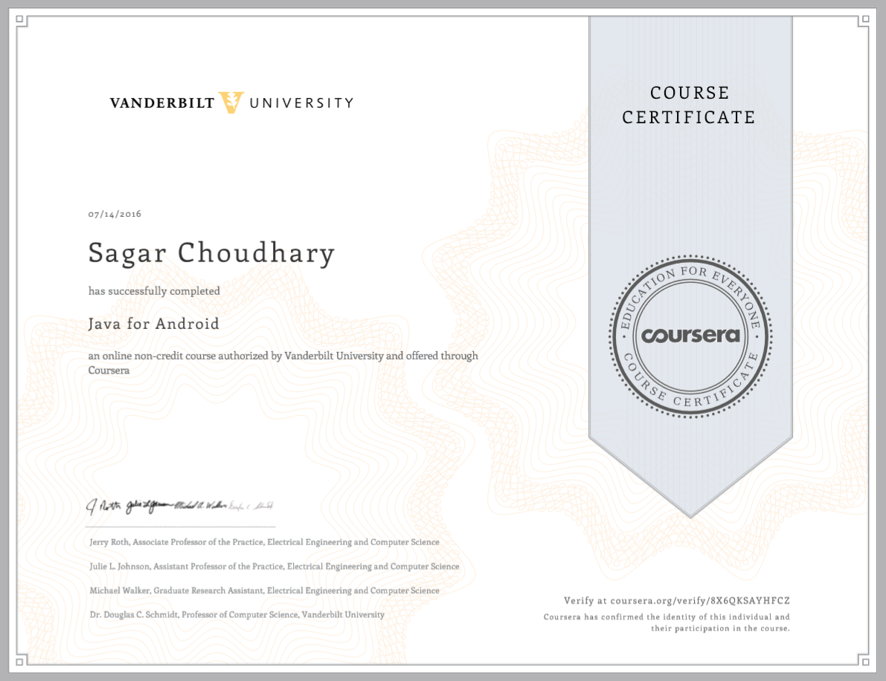

# COURSERA JAVA FOR ANDROID MOOC COURSE

#### About MOOC COURSE

This MOOC teaches you how to program core features and classes from the Java programming language
that are used in Android, which is the dominant platform for developing and deploying mobile device apps.

#### Topics Covered

* Overview of Android Studio
* Creating a simple Android app using Java primitive Data types, classes and method
* Java  various looping constructs and conditional statements
* Java built-in arrays and common classes in the Java Collections Framework, such as ArrayList and HashMap
* Java's primitive and user-defined types, fields, methods, generic parameters, and exceptions
* Inheritance and Polymorphism (such as subclass and overriding virtual methods)
* Exceptions Handling

#### Course Certificate

